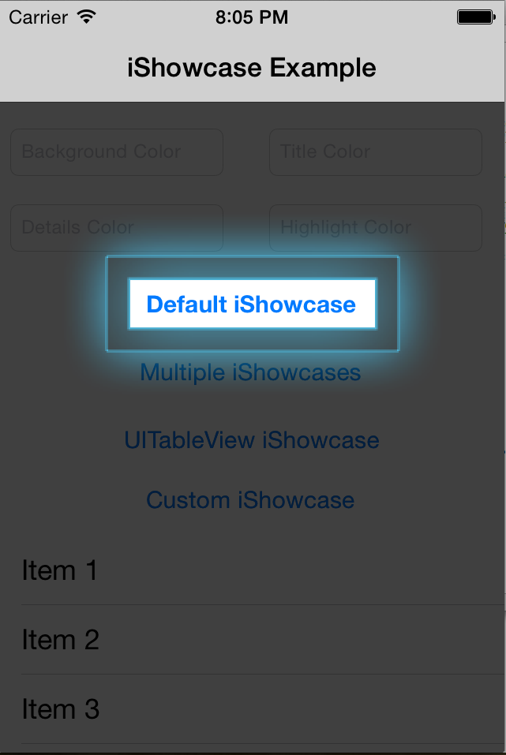
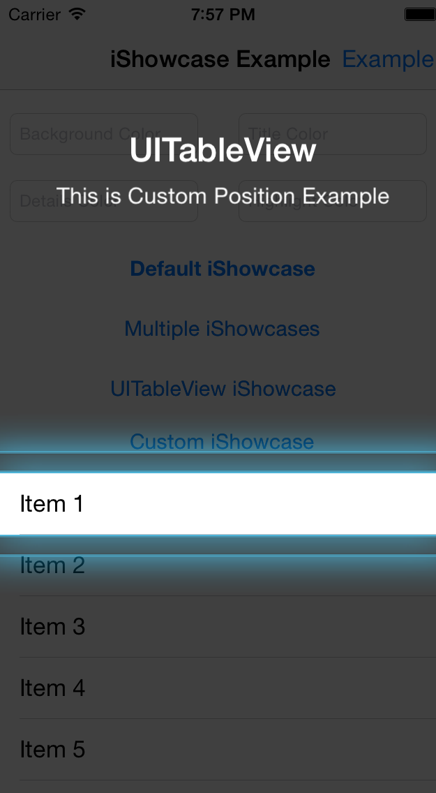
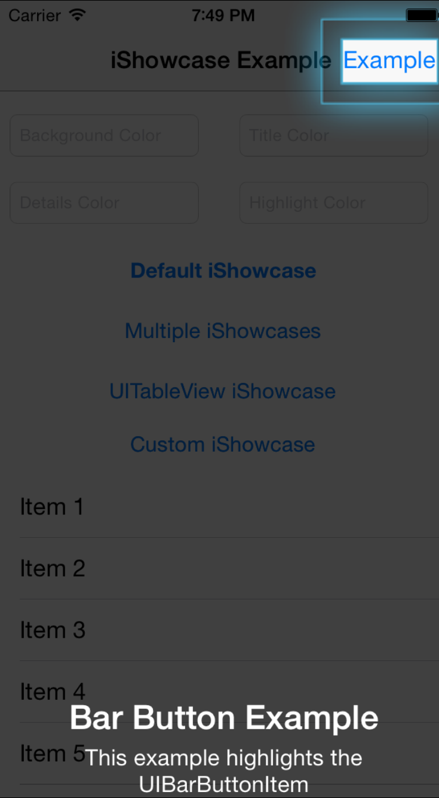

# iShowcase

Highlight individual parts of your application using iShowcase

[](https://travis-ci.org/rahuliyer95/iShowcase)
[](http://cocoadocs.org/docsets/iShowcase)
[](http://cocoadocs.org/docsets/iShowcase)
[](http://cocoadocs.org/docsets/iShowcase)
[](http://www.github.com/rahuliyer95/iShowcase/issues?state=open)

## Screenshots






## Requirements
* Xcode 5 or higher
* Apple LLVM compiler
* iOS 6.0 or higher
* ARC

## Installation

iShowcase is available through [CocoaPods](http://cocoapods.org). To install
it, simply add the following line to your Podfile:

    pod "iShowcase", "~> 1.3"

or

* Add the `iShowcase.h` and `iShowcase.m` files to your project
* Add `#include "iShowcase.h"` to your ViewController

## [Documentation](http://rahuliyer95.github.io/iShowcase/docs)

## Usage

To run the example project, clone the repo, and run `pod install` from the Example directory first.

#### Creating Instance

``` objective-c
// Create Object of iShowcase
iShowcase *showcase = [[iShowcase alloc] init];

// Other init Methods
initWithTitleFont: (UIFont*) titleFont detailsFont: (UIFont*) detailsFont;
initWithTitleColor: (UIColor*) titleColor detailsColor: (UIColor*) detailsColor;
```
#### Delegate

``` objective-c
showcase.delegate = self;
```
#### Delegate Methods

``` objective-c
iShowcaseShown // Called When Showcase is displayed
iShowcaseDismissed // Called When Showcase is removed
```

#### Displaying iShowcase
``` objective-c
[showcase setupShowcaseForView:(UIView *) title:(NSString *) details:(NSString *)];
[showcase show];

// For Custom Location
[showcase setupShowcaseForLocation:(CGRect location) title:(NSString *) details:(NSString *)];
[showcase show];

// Methods for other UI Elements

setupShowcaseForBarButtonItem:(UIBarButtonItem *) withTitle:(NSString *) details:(NSString *)
setupShowcaseForTableView:(UITableView *) withTitle:(NSString *) details:(NSString *)
setupShowcaseForTableView:(UITableView *) withIndexOfItem:(NSUInteger) sectionOfItem:(NSUInteger) title:(NSString *) details:(NSString *)

```

#### Customizations

``` objective-c

// Constants
const int TYPE_CIRCLE = 0;
const int TYPE_RECTANGLE = 1;

setBackgroundColor: (UIColor *) backgroundColor;
setTitleFont: (UIFont*) font;
setDetailsFont: (UIFont*) font;
setTitleColor: (UIColor*) color;
setDetailsColor: (UIColor*) color;
setHighlightColor:(UIColor*) highlightColor;
setIType: (int) type;
setRadius: (CGFloat) radius;
setSingleShotId: (long) singleShotId;
```

## Credits

Inspired from [ShowcaseView](https://github.com/amlcurran/Showcaseview) by [Alex Curran](https://github.com/amlcurran/)

## Author

rahuliyer95, rahuliyer573@gmail.com

## License

iShowcase is available under the MIT license. See the LICENSE file for more info.

